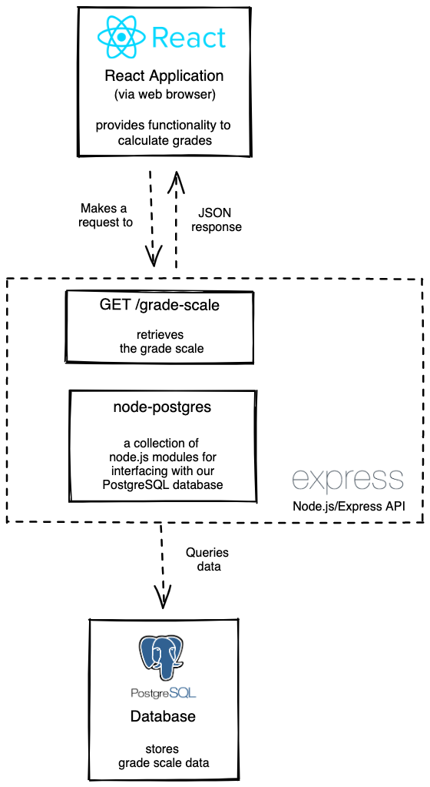
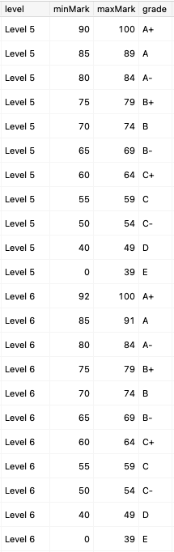

# 03 Project - Grade Calculator

**Contents:**

- [03 Project - Grade Calculator](#03-project---grade-calculator)
  - [Assessment details](#assessment-details)
  - [Scenario](#scenario)
  - [Architecture Diagrams](#architecture-diagrams)
  - [Entity-Relationship Diagram](#entity-relationship-diagram)
  - [Getting Started](#getting-started)
  - [Instructions](#instructions)
    - [Part A - Planning](#part-a---planning)
    - [Part B - Development Process](#part-b---development-process)
    - [Part C - Grade Calculator](#part-c---grade-calculator)
    - [Part D - Tests](#part-d---tests)
    - [Part E - User Experience](#part-e---user-experience)
    - [Part F - OpenAPI](#part-f---openapi)
    - [Part G - Code Quality](#part-g---code-quality)

---

## Assessment details

- [Level 5 Learning Outcomes](./docs/learning-outcomes-l5.md)
- [Level 6 Learning Outcomes](./docs/learning-outcomes-l6.md)

---

## Scenario

You are working for a new startup, Grade Calculator. Its grading system allows tertiary education institutions to calculate the grades of Level 5 and Level 6 students.

The previous Software Engineer started building the application but was urgently re-assigned to a different part of the business. You need to complete the remaining user stories for the web application, following the documentation below.

Your Tech Lead can support you if you need help understanding the requirements or are blocked with something in particular.

---

## Architecture Diagrams



## Entity-Relationship Diagram


---

## Getting Started

**To build and run the app:**

```zsh
docker-compose up --build
```

**To run the client-side unit tests:**

```zsh
cd client
npm install
npm test
```

---

## Instructions

### Part A - Planning

<details>
  <summary>Instructions</summary>

Read through this project and get an idea of work that you will need to implement.

To plan, organize and prioritize your work you will use GitHub Issues and a GitHub Project board. You do not need to implement each project part in the sequential order of Parts B-G. You will need to break down your work into small, manageable pieces.

You may end up with several GitHub Issues that make up one project part, and issues which contain work from a combination of the different project parts (eg. one issue containing both testing requirements and implementation of functionality).

**Acceptance criteria**

1. Each piece of work required is captured in a [GitHub Issue](https://docs.github.com/en/issues/tracking-your-work-with-issues/about-issues).
2. A [GitHub Project board](https://docs.github.com/en/issues/organizing-your-work-with-project-boards/managing-project-boards/about-project-boards) is used to visualize your work.
3. Only one issue is _In Progress_ at any given time.
4. Each GitHub Issue contains acceptance criteria/test cases.
</details>

---

### Part B - Development Process

<details>
  <summary>Instructions</summary>

To avoid any waste for your workplace and technical debt for the client, it is important that you adhere to good development practices whilst working on this project.

**Acceptance criteria**

1. [Meaningful commit messages](https://reflectoring.io/meaningful-commit-messages/).
2. Frequent commits, demonstrating progression of development.
3. A separate branch is used for each GitHub Issue you work on.
4. Pull requests are created for each GitHub Issue and merged into the `main` branch.
5. All [pull requests include a description](https://github.blog/2015-01-21-how-to-write-the-perfect-pull-request/) explaining the changes made and have the tech lead and teaching assistant added as [reviewers](https://docs.github.com/en/pull-requests/collaborating-with-pull-requests/proposing-changes-to-your-work-with-pull-requests/requesting-a-pull-request-review).
6. Pull requests have comments added to ask for help/feedback, if needed. A clear description of any issues is provided.
7. You should acknowledge all feedback given on pull requests and action the feedback given appropriately.
8. The project is submitted correctly in GitHub with code merged to the `main` branch before the deadline.
9. The project is turned in on Google Classroom.
10. [Feedback](https://docs.google.com/forms/d/e/1FAIpQLSc5t9C5wsMNN7uDKTKvY6W7jKMU_9OE00KWnSjr3OCMS5Qj-w/viewform?usp=pp_url&entry.1220290274=Project&entry.1443355662=Grade+Calculator) has been completed.

</details>

---

### Part C - Grade Calculator

<details>
  <summary>Instructions</summary>

Implement the [`getLetterGrade` utility function](./client/src/utils.js).

**User story**

- As a tertiary education institution administrator
- I want to calculate the students’ grades
- So that I can complete the students’ transcripts.

**Acceptance criteria**

- The `getLetterGrade` utility function uses the supplied `gradeScale`, `mark` and `level` to determine the correct letter grade.
- The `getLetterGrade` utility function does not return any hardcoded values.
- Validation is implemented for all arguments of the `getLetterGrade` utility function.
- GIVEN the grade calculator form is completed correctly, WHEN the user submits the form, THEN the correct grade is provided to the user.
- GIVEN the grade calculator form is completed incorrectly, WHEN the user submits the form, THEN a useful error message is displayed to the user.

**Dev tips**

- The grade conversion rules are stored in the database. Get your SQL query right in your SQL client of choice. Once you have the correct data, it should be easy to send it back up the stack from the API server to the React app to the [`getLetterGrade` utility function](./client/src/utils.js).



</details>

---

### Part D - Tests

<details>
  <summary>Instructions</summary>

To improve the maintainability of the application, add unit tests for the `getLetterGrade` utility function. Make sure that they all pass.

**Acceptance criteria**

1. All happy path scenarios are covered with unit tests. (There is at least one test case for each row of the `grade_scale` table.)
2. Negative scenarios for all parameters of the `getLetterGrade` utility function are covered with unit tests.
3. All tests are meaningful, well named by explaining what they are testing, and pass.
4. There is little to no repetition in logic.

</details>

---

### Part E - User Experience

<details>
  <summary>Instructions</summary>

To improve the user experience design wireframes for the app. Use your wireframes when you implement and style the app. Remember to consider the different states of the app (happy pathway and error pathways).

**Acceptance criteria**

1. Wireframes are created. Screenshots or images of the wireframes are added to the [wireframes folder](./wireframes/wireframes.md). The wireframes consider different breakpoints for responsive design for mobile and desktop sizes.
2. The web application is styled using CSS and is responsive.
3. The design layout matches the wireframes, including responsive design.
4. There are no violations of [design principles](https://www.youtube.com/watch?v=a5KYlHNKQB8).
5. The HTML generated from the React app is [valid](https://validator.w3.org/#validate_by_input) and [semantically correct](https://html.com/semantic-markup/).
6. The CSS is [valid](https://jigsaw.w3.org/css-validator/#validate_by_input). The CSS class names are meaningful. No unused CSS rules or properties are left in the project.

</details>

---

### Part F - OpenAPI

<details>
  <summary>Instructions</summary>
  
To improve the developer experience and maintainability of the API, update the [OpenAPI spec](./server/apispec.yaml) file to match the requested functionality of the API.

**Acceptance criteria**

1. The OpenAPI spec file reflects the functionality of the API.
2. There are no validation problems.

</details>

---

### Part G - Code Quality

<details>
  <summary>Instructions</summary>

Your Tech lead has stressed the importance of the quality and maintainability of the code in your project due to the vast number of clients that your business looks after. There is no time available for you to go back later and clean things up.

**Acceptance criteria**

1. Code uses the repository design pattern so that it is easy to maintain and reuse.
2. All code is formatted using Prettier.
3. Code is logical and easy to read and understand.
4. Function and variable names are meaningful, useful, and consistent.
5. Comments are added, if needed, following the rule of "Code Tells You How, Comments Tell You Why".
6. There is little to no repetition in logic.
7. No warnings, errors, bugs or syntax problems.
8. No unused code is left in the project.

</details>

---
